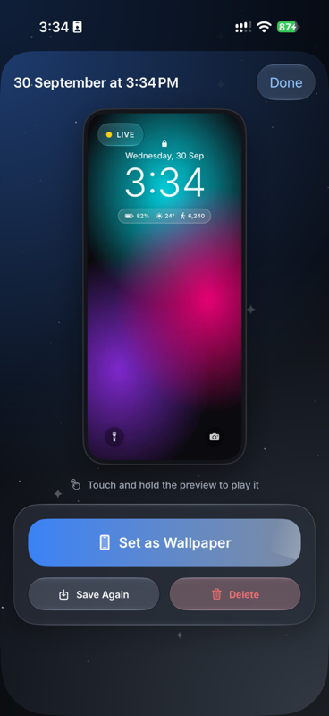
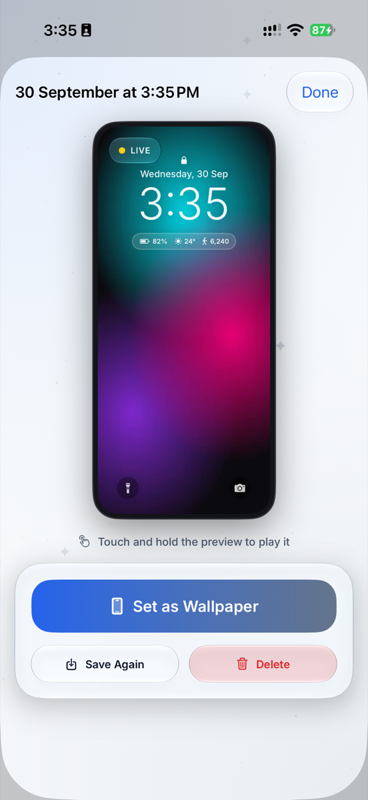

<p align="center">
  <picture>
    <source media="(prefers-color-scheme: dark)" srcset="Branding/GlitterLive-Logo-Horizontal-Dark-Transparent.png">
    
  </picture>
</p>

<p align="center">
  Turn any video into a Live Photo wallpaper that moves every time you wake your iPhone.
</p>

<p align="center">
  
  
  
  
</p>
<p align="center">
  
  
  
  
</p>

<details>
<summary>Light mode</summary>
<p align="center">
  
  
  
  
</p>
<p align="center">
  
  
  
  
</p>
</details>

## Features

- **Video to Live Wallpaper**: pick any video, trim a 1–3 second moment, and save it as a Live Photo that plays on the Lock Screen when the iPhone wakes.
- **Trim Studio**: filmstrip with trim handles, pinch-and-drag framing inside a Lock Screen preview (clock, widgets and quick actions), cover-frame picker, 0.5×–2× speed and a forward-and-back bounce.
- **Sharp cover photo**: the still shown while the phone is locked is rendered from the original video at up to 1320 px wide, sharper than the motion clip.
- **Library**: every wallpaper is kept in the app, so it can be previewed, saved to Photos again or deleted.
- **Private by design**: only asks to *add* photos, never reads the library, and collects no data.
- **Silver Shimmer design**: light and dark modes that follow the system, an obsidian dark mode lit by brand blue and silver, softly twinkling glitter, and native Liquid Glass on iOS 26+ with frosted fallbacks on iOS 17–25.
- Free, with no watermark.

## Lock Screen motion

Photos accepts any still and movie that share a content identifier as a Live Photo. The Lock Screen's wallpaper editor is stricter, and reports *"Motion Not Available"* unless the movie meets extra, undocumented requirements. Glitter Live writes:

- 8-bit HEVC video with the long side at most 1920 px and a duration of 5 s or less
- a `live-photo-info` timed-metadata track, one sample per frame
- a `still-image-time` + `live-photo-still-image-transform` sample at the cover frame, in the 600 timescale and never at 0 s
- a cover photo that shows the same frame as the movie (it may be larger)

See [`LivePhotoBuilder.swift`](LiveWall/Core/LivePhoto/LivePhotoBuilder.swift) and [`LivePhotoMetadata.swift`](LiveWall/Core/LivePhoto/LivePhotoMetadata.swift).

## Requirements

- iOS 17 or later (Lock Screen Live Photo motion needs iOS 17+)
- Xcode 26 or later
- [XcodeGen](https://github.com/yonaskolb/XcodeGen)

## Getting started

```bash
brew install xcodegen
xcodegen generate
open LiveWall.xcodeproj
```

Set your own development team in `project.yml` (`DEVELOPMENT_TEAM`), or under Signing & Capabilities in Xcode, then run on an iPhone. The Simulator can't show Lock Screen wallpapers, so test motion on a real device.

## Tests

```bash
xcodebuild test -project LiveWall.xcodeproj -scheme LiveWall \
  -destination 'platform=iOS,name=<your iPhone>' -only-testing:LiveWallTests
```

- `LiveWallTests`: Live Photo pairing, required metadata tracks, output size and length, speed and bounce, cover-photo resolution and frame match, and the Library.
- `LiveWallUITests`: launches each screen with demo content (`-demoVideo`, `-demoResult`, `-demoLibrary`) and attaches screenshots to the test result.

## Project structure

```
LiveWall/
  App/            App entry point and tab bar
  Core/LivePhoto/ Video → Live Photo pipeline, saving and preview
  DesignSystem/   Colors, type, glass components, Lock Screen overlay
  Features/       Convert, Library, Onboarding, Settings, Explore and Create previews
  Resources/      Assets, fonts, privacy manifest
LiveWallTests/    Unit tests
LiveWallUITests/  On-device screenshot tests
Branding/         Logo files
scripts/          Icon, logo and app-bar logo renderer (swift scripts/render-icon.swift <dir> [icon|logo|appbar])
```

## Roadmap

- Explore: a curated catalog of live wallpapers
- Create: generate live wallpapers from a text prompt or a photo, free and ad-supported
- App Store release

## Acknowledgements

- [LivePaper](https://github.com/Yuyang16Z/LivePaper) (MIT) for documenting the Lock Screen's Live Photo requirements. See [THIRD_PARTY_NOTICES.md](THIRD_PARTY_NOTICES.md).
- [Inter](https://rsms.me/inter/) typeface (SIL Open Font License).
