<p align="center">
  <picture>
    <source media="(prefers-color-scheme: dark)" srcset="Branding/GlitterLive-Logo-Horizontal-Dark-Transparent.png">
    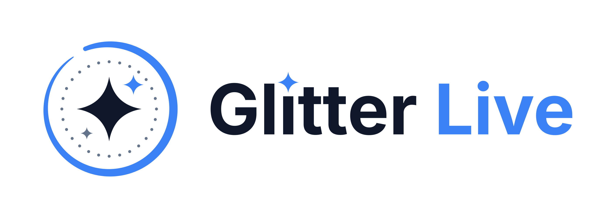
  </picture>
</p>

<p align="center">
  Turn any video into a Live Photo wallpaper that moves every time you wake your iPhone.
</p>

<p align="center">
  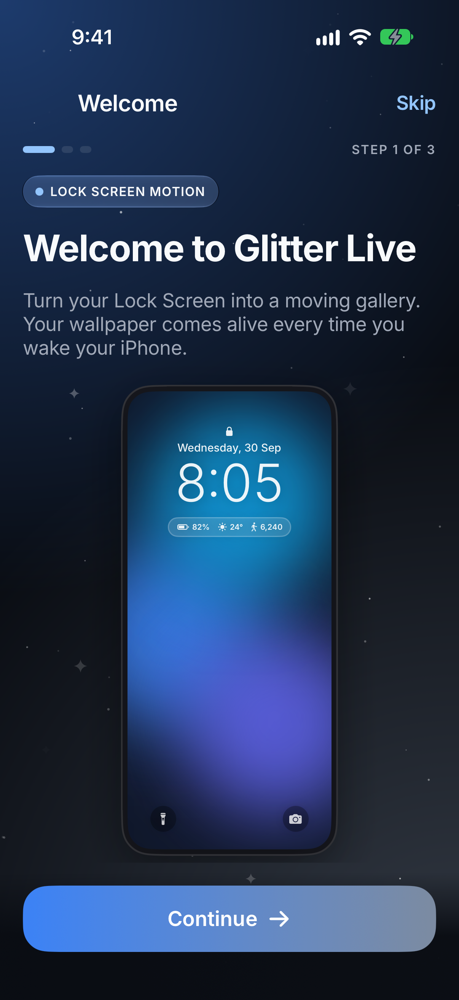
  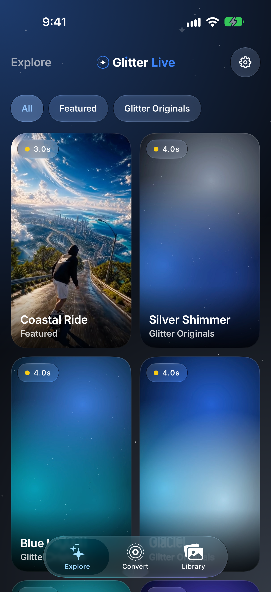
  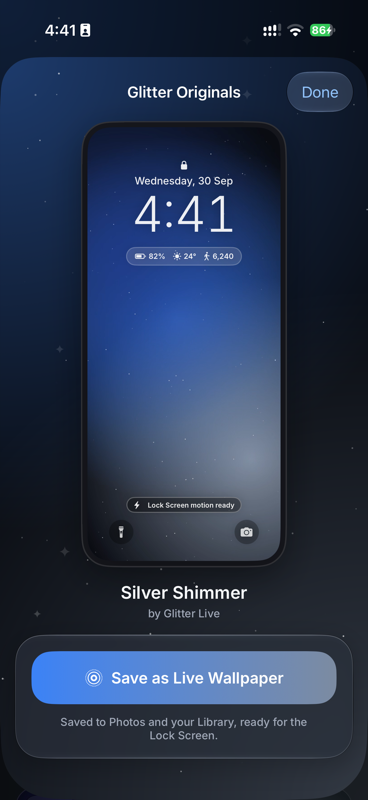
  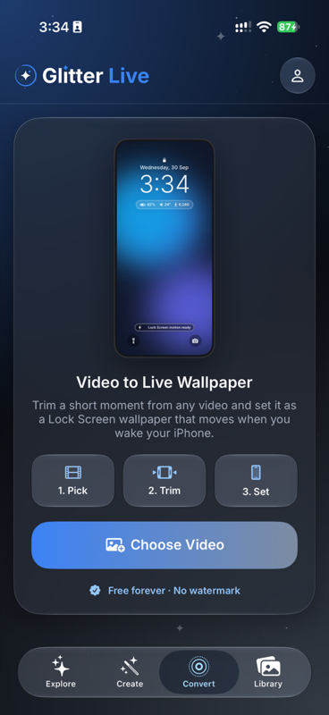
</p>
<p align="center">
  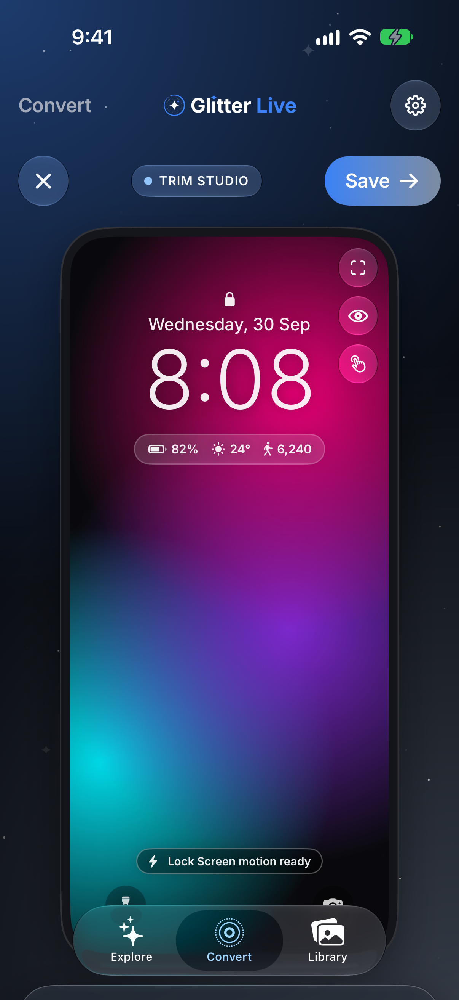
  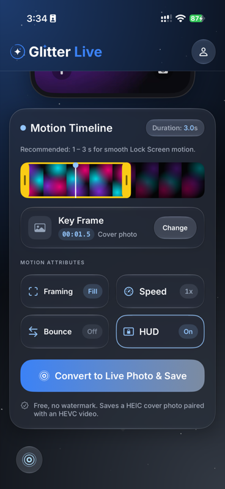
  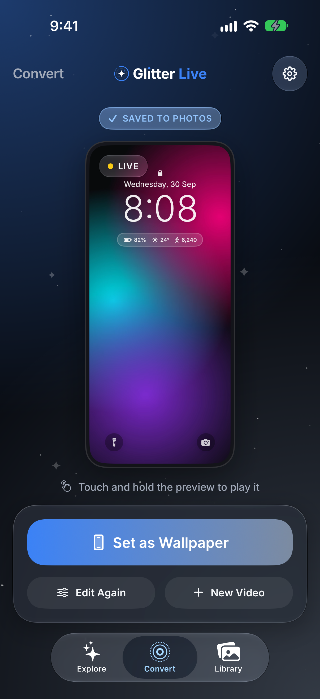
  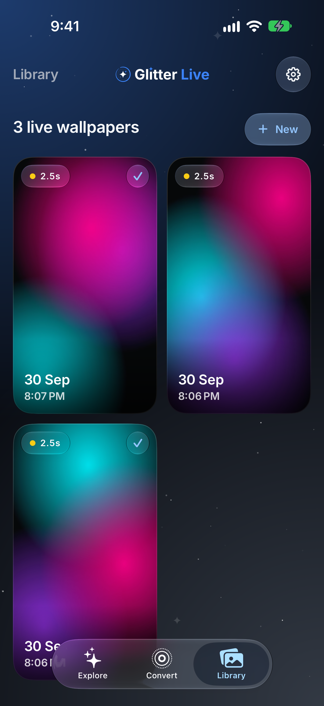
</p>

<details>
<summary>Light mode</summary>
<p align="center">
  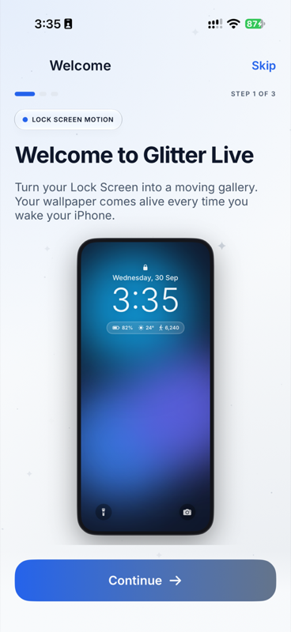
  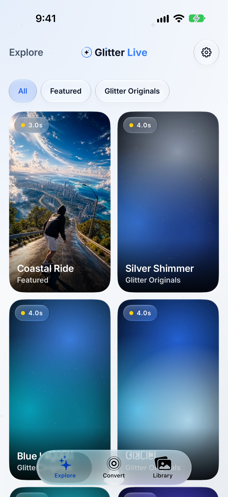
  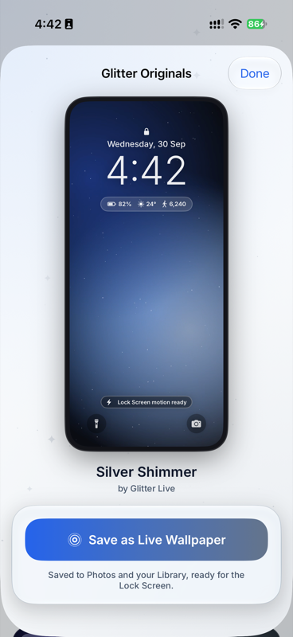
  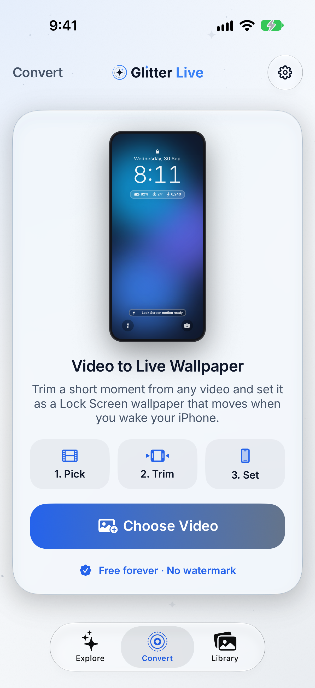
</p>
<p align="center">
  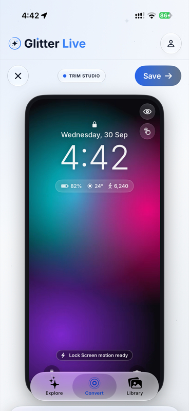
  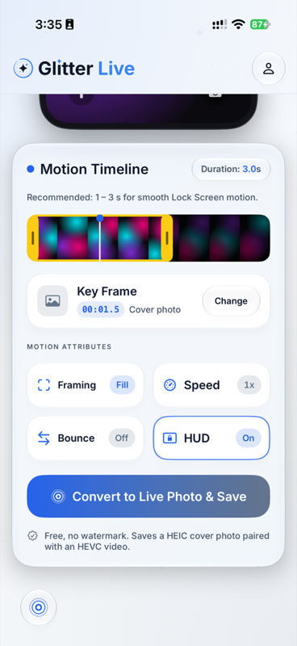
  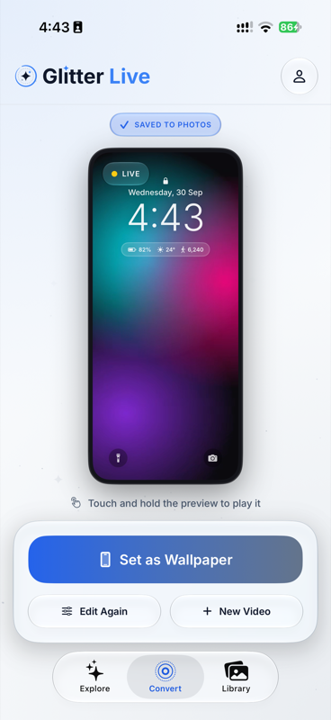
  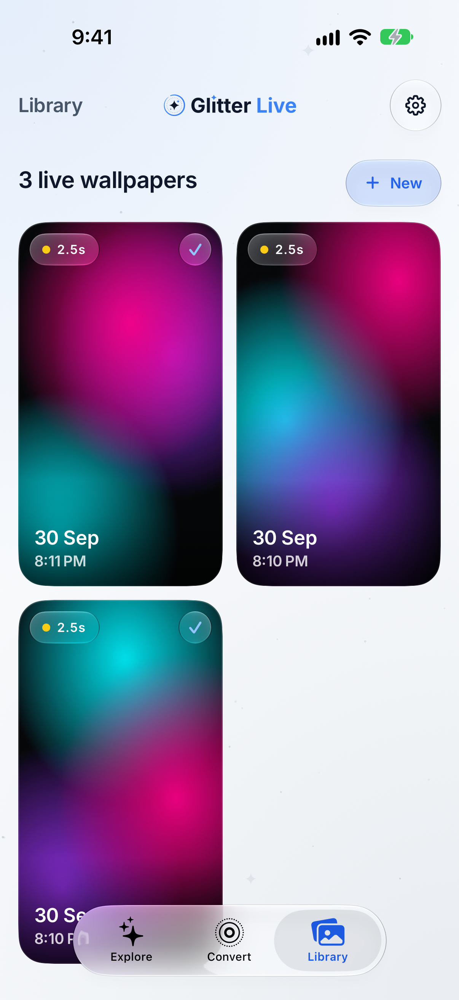
</p>
</details>

## Features

- **Explore**: the first tab, a curated catalog of live wallpapers, served from Supabase, that saves to Photos as a Lock Screen-ready Live Photo in one tap. It opens on a playing Featured wallpaper, and touching and holding any wallpaper previews its motion. While the catalog loads, shimmering placeholders hold the page's shape, and the cards rise into place in a wave when it arrives.
- **Video to Live Wallpaper**: pick any video, trim a 1–3 second moment, and save it as a Live Photo that plays on the Lock Screen when the iPhone wakes. Videos can come from Photos, Files, a direct link (Dropbox and Google Drive share links work), or Share → Glitter Live from another app.
- **Trim Studio**: filmstrip with trim handles that preview the frame under your finger and stretch softly at their limits, a draggable cover-frame marker, pinch-and-drag framing inside a Lock Screen preview (clock, widgets and quick actions) that springs back with your finger's momentum, 0.5×–2× speed and a forward-and-back bounce.
- **Sharp cover photo**: the still shown while the phone is locked is rendered from the original video at up to 1320 px wide, sharper than the motion clip.
- **Library**: every wallpaper is kept in the app, so it can be previewed, saved to Photos again or deleted.
- **Private by design**: videos are processed on the device, and the app only asks to *add* photos, never reading the library. The only data collected is what Google's ad SDK needs when someone chooses to watch an ad (see [privacy](docs/privacy.md)).
- **Silver Shimmer design**: light and dark modes that follow the system, an obsidian dark mode lit by brand blue and silver, softly twinkling glitter, and native Liquid Glass on iOS 26+ with frosted fallbacks on iOS 17–25. A logo reveal plays as the app launches.
- **Accessible**: Dynamic Type with size-tuned letter-spacing, Reduce Motion, Increase Contrast and Reduce Transparency are all supported.
- **Free to try**: Explore and the first 5 conversions are free; then each conversion is free with a rewarded ad, or a one-time Unlimited Conversions purchase removes the limit and the ads. Never a watermark.

## Lock Screen motion

Photos accepts any still and movie that share a content identifier as a Live Photo. The Lock Screen's wallpaper editor is stricter, and reports *"Motion Not Available"* unless the movie meets extra, undocumented requirements. Glitter Live writes:

- 8-bit HEVC video with the long side at most 1920 px and a duration of 5 s or less
- a `live-photo-info` timed-metadata track, one sample per frame
- a `still-image-time` + `live-photo-still-image-transform` sample at the cover frame, in the 600 timescale and never at 0 s
- a cover photo that shows the same frame as the movie (it may be larger)

See [`LivePhotoBuilder.swift`](LiveWall/Core/LivePhoto/LivePhotoBuilder.swift) and [`LivePhotoMetadata.swift`](LiveWall/Core/LivePhoto/LivePhotoMetadata.swift).

## Catalog backend

Explore reads the `wallpapers` table (read-only for the app's publishable key) and downloads files from a public Supabase Storage bucket. To add a wallpaper:

```bash
cp scripts/storage.env.example scripts/storage.env   # fill in the S3 and secret keys; this file is git-ignored
scripts/upload-wallpaper.sh ~/Movies/loop.mp4 --title "Neon Rain" --category "Abstract" --creator "Your Name"
```

The table is created by [`supabase/migrations/0001_wallpapers.sql`](supabase/migrations/0001_wallpapers.sql).

## Requirements

- iOS 17 or later (Lock Screen Live Photo motion needs iOS 17+)
- Xcode 26 or later
- [XcodeGen](https://github.com/yonaskolb/XcodeGen)

## Getting started

```bash
brew install xcodegen
./scripts/fetch-depth-model.sh
xcodegen generate
open LiveWall.xcodeproj
```

`fetch-depth-model.sh` downloads Apple's Core ML Depth Anything V2 (about 19 MB), which Create uses for parallax motion. Without it the app still builds and falls back to a plain push-in. Building the parallax kernel needs Xcode's Metal Toolchain (`xcodebuild -downloadComponent MetalToolchain`).

Set your own development team in `project.yml` (`DEVELOPMENT_TEAM`), or under Signing & Capabilities in Xcode, then run on an iPhone. The Simulator can't show Lock Screen wallpapers, so test motion on a real device.

Release builds read the real AdMob IDs from `Config/AdMob.secrets.xcconfig`, which isn't committed. Without it they still build, with Google's sample IDs, and show no ads; debug builds always use the samples.

## Tests

```bash
xcodebuild test -project LiveWall.xcodeproj -scheme LiveWall \
  -destination 'platform=iOS,name=<your iPhone>' -only-testing:LiveWallTests
```

- `LiveWallTests`: Live Photo pairing, required metadata tracks, output size and length, speed and bounce, cover-photo resolution and frame match, and the Library.
- `LiveWallUITests`: launches each screen with demo content (`-demoVideo`, `-demoResult`, `-demoLibrary`) and attaches screenshots to the test result.

## CI and deployment

| Workflow | Runs on | Does |
| --- | --- | --- |
| [CI](.github/workflows/ci.yml) | every pull request and push to `main` | builds the app and runs `LiveWallTests` on an iPhone simulator (Xcode 26.6), except the suites that encode video, which are too slow on GitHub's GPU-less runners; type-checks the Supabase function |
| [Deploy Supabase functions](.github/workflows/deploy-functions.yml) | pushes to `main` that change `supabase/functions/`, or by hand | deploys `generate`; needs the `SUPABASE_ACCESS_TOKEN` repository secret |
| [Release](.github/workflows/release.yml) | pushing a `v*` tag | checks the tag matches `MARKETING_VERSION` and creates a GitHub release with notes from the merged pull requests |
| Xcode Cloud | `v*` tags, once set up in App Store Connect | archives and uploads to TestFlight; [`ci_scripts/ci_post_clone.sh`](ci_scripts/ci_post_clone.sh) generates the project, fetches the depth model and writes the AdMob IDs from the `GAD_APPLICATION_ID` and `GAD_REWARDED_AD_UNIT_ID` secret environment variables |

Database migrations aren't deployed automatically; run `supabase db push` after reviewing them.

### Releasing

The App Store version is `MARKETING_VERSION` in `project.yml` (1.0.1 for fixes, 1.1.0 for features); Xcode Cloud sets the build number. To release, bump the version in a pull request, merge it, then tag the merge:

```bash
git tag v1.1.0
git push origin v1.1.0
```

A tag with a suffix, such as `v1.1.0-beta.1`, makes a pre-release.

## Project structure

```
LiveWall/
  App/            App entry point, tab bar and launch intro
  Core/LivePhoto/ Video → Live Photo pipeline, saving and preview
  DesignSystem/   Colors, type, glass components, motion, logo artwork, Lock Screen overlay
  Core/Catalog/   Supabase catalog client and downloads
  Features/       Explore, Convert, Library, Onboarding, Settings
  Resources/      Assets, fonts, privacy manifest
LiveWallTests/    Unit tests
LiveWallUITests/  On-device screenshot tests
Branding/         Logo files, layered SVGs and the Jitter logo reveal
docs/             Privacy policy, support page, App Store listing, screenshots
scripts/          Icon, logo and SVG renderer, wallpaper upload tools
supabase/         Database migrations
```

## Roadmap

### 1.0: built, not yet submitted

- [x] Video to Live Wallpaper with Trim Studio, Library and Explore
- [x] Design pass on Apple's fluid-interface guidance: interruptible springs, momentum, rubber-banding, press feedback, card-to-detail zoom transitions and consistent haptics
- [x] Accessibility: Dynamic Type, Reduce Motion, Increase Contrast and Reduce Transparency
- [x] Launch logo reveal
- [x] Explore: playing Featured wallpaper and touch-and-hold motion preview
- [x] Release prep: version 1.0.0, [privacy policy](docs/privacy.md), [support page](docs/support.md) and [App Store listing](docs/app-store.md)
- [x] Launch time measured at about 270 ms to first frame on an iPhone 17 Pro
- [ ] App Store submission: 6.9" screenshots, archive and upload
- [ ] Refresh the README screenshots for the latest design

### Next

- **Create** (in progress, [plan](docs/create-plan.md)): type a prompt and get a wallpaper image from FLUX.1 schnell, then save it as a still or add motion on the phone (depth parallax) to save it as a Live wallpaper. AI video motion (LTX-Video) is ready on the server for later. Hidden behind `FeatureFlags.aiGeneration` in release builds until it works end to end.
- **Pricing**: one subscription. The first 5 generations are free, then each generation unlocks with a short rewarded ad (up to 10 a day). **Glitter Live Pro** (₹299 a month) removes ads and allows up to 100 generations a month. Explore stays free with no ads. Convert gives 5 free conversions, then each one unlocks with a short rewarded ad, or a one-time **Unlimited Conversions** purchase removes the limit for good.
- **Explore extras** from the mockup: search, sort by New, and later like counts and Free/VIP badges (likes need backend support; badges need pricing).
- **Trim Studio**: video stabilization (the mockup's Stabilize toggle).
- **Smoothness**: profile scrolling with Instruments. 120 Hz on ProMotion and pausing background effects on hidden tabs are done.

## Acknowledgements

- [LivePaper](https://github.com/Yuyang16Z/LivePaper) (MIT) for documenting the Lock Screen's Live Photo requirements. See [THIRD_PARTY_NOTICES.md](THIRD_PARTY_NOTICES.md).
- [Inter](https://rsms.me/inter/) typeface (SIL Open Font License).
- [Depth Anything V2](https://github.com/DepthAnything/Depth-Anything-V2) Small, in [Apple's Core ML conversion](https://huggingface.co/apple/coreml-depth-anything-v2-small) (Apache-2.0), for Create's parallax motion.

## License

Glitter Live is released under the [MIT License](LICENSE). The bundled Inter font files keep their own SIL Open Font License, and third-party notices are in [THIRD_PARTY_NOTICES.md](THIRD_PARTY_NOTICES.md).
